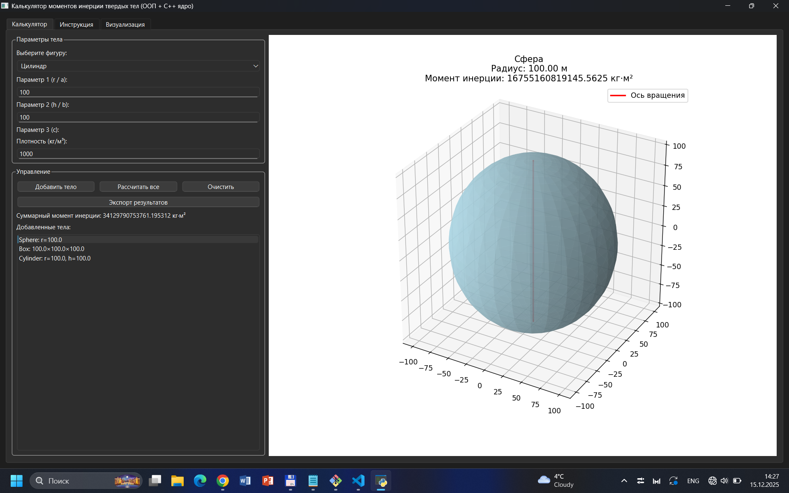
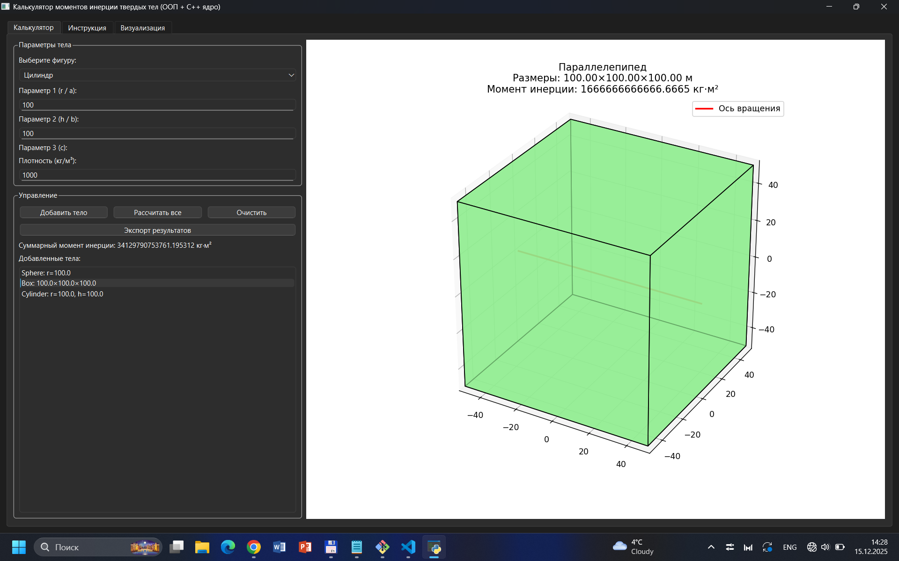
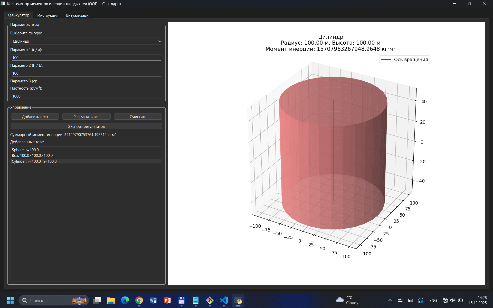
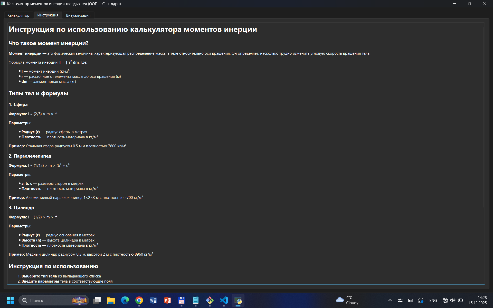
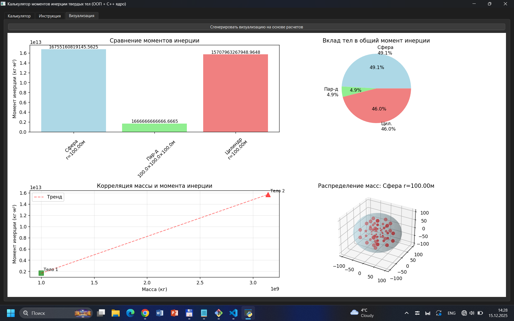

# 🌀 Inertia Calculator Hybrid 5

**Гибридный калькулятор момента инерции твёрдых тел** с 3D-визуализацией, экспортами и вычислительным ядром на C++.  
Идеален для учебных проектов, физических расчётов и демонстрации ООП + межъязыкового взаимодействия.

> ⚠️ **Внимание**: В репозитории присутствуют большие файлы (например, `*.pkg`, `*.dll` > 50 МБ).  
> Для корректной работы с ними **рекомендуется использовать [Git LFS](https://git-lfs.com)**.  
> См. раздел **«Работа с большими файлами»** ниже.

---

## 🔍 Возможности

- 🧮 Расчёт момента инерции для:  
  - **Сферы** (`I = 2/5·m·r²`)  
  - **Параллелепипеда** (`I = 1/12·m·(b² + c²)`)  
  - **Цилиндра** (`I = 1/2·m·r²`)
- 📊 Автоматический расчёт массы по плотности и геометрии
- 🖼️ **3D-визуализация** тел и распределения масс
- 📈 Аналитические графики:  
  - Сравнение моментов инерции  
  - Вклад каждого тела в суммарный момент  
  - Корреляция массы и момента инерции
- 💾 Экспорт результатов в **TXT** и **PDF**
- 📘 Встроенная **инструкция** с формулами и примерами
- 🎛️ Интерактивный GUI на **PyQt6**

---

## ⚙️ Архитектура

Проект использует **гибридную архитектуру** для сочетания производительности и удобства:

### 🧠 Ядро — C++ (DLL)
- Классы: `Sphere`, `Box`, `Cylinder` → наследуют абстрактный `Body`
- Формулы соответствуют стандартной физике
- Собирается в `inertia.dll` (Windows)
- Предоставляет **C-совместимый интерфейс** через `extern "C"`

### 🖥️ Интерфейс — Python
- GUI: **PyQt6**
- Визуализация: **Matplotlib + NumPy**
- Взаимодействие с DLL: **`ctypes`**
- Экспорт PDF: **`reportlab`**

---

## 📘 Инструкция по использованию

1. **Выберите тип тела** из выпадающего списка:  
   - Сфера  
   - Параллелепипед  
   - Цилиндр

2. **Введите параметры тела** в соответствующие поля:  
   - Для **сферы** — укажите радиус `r`  
   - Для **параллелепипеда** — укажите три стороны: `a`, `b`, `c`  
   - Для **цилиндра** — укажите радиус `r` и высоту `h`

3. **Укажите плотность материала** в кг/м³ (по умолчанию: `1000` — плотность воды).

4. Нажмите кнопку **«Добавить тело»**, чтобы включить объект в список расчёта.

5. После добавления одного или нескольких тел нажмите **«Рассчитать все»**, чтобы вычислить моменты инерции и суммарный результат.

6. **Выберите тело в списке** — справа автоматически отобразится его **3D-визуализация** с подписью момента инерции.

7. Чтобы сохранить результаты, нажмите **«Экспорт результатов»** и выберите формат:  
   - `.txt` — простой текстовый файл  
   - `.pdf` — отформатированный документ (требуется установленный `reportlab`)

8. Перейдите во вкладку **«Визуализация»** и нажмите **«Сгенерировать визуализацию на основе расчетов»**, чтобы увидеть:
   - Сравнение моментов инерции  
   - Вклад каждого тела в общий момент  
   - Корреляцию массы и инерции  
   - 3D-модель первого добавленного тела

> 💡 **Совет**: Используйте встроенную вкладку **«Инструкция»** для получения справки по формулам, примерам и полезным значениям плотности (алюминий, сталь, медь и др.).

---
## 🖼️ Скриншоты программы

Проект выполнен Голяс Анастасией ПМР-231